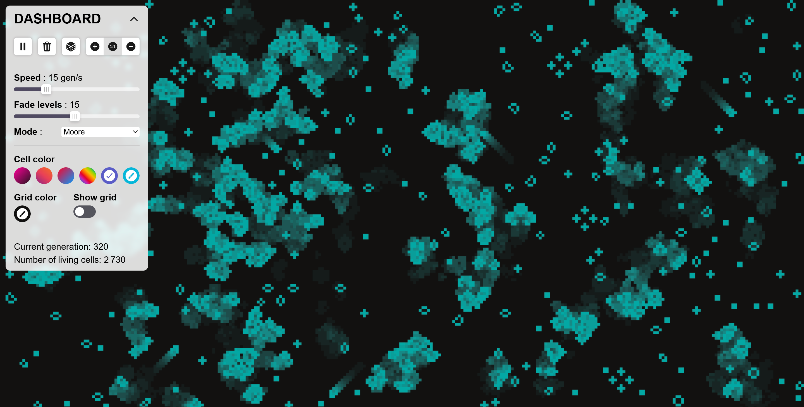
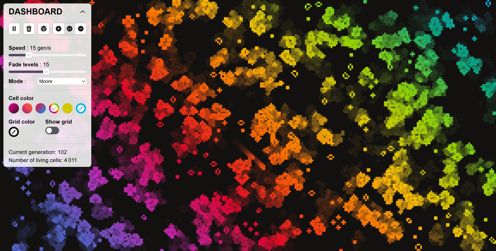
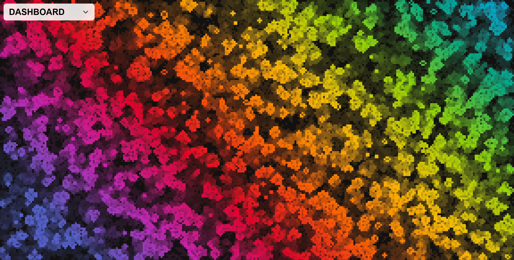
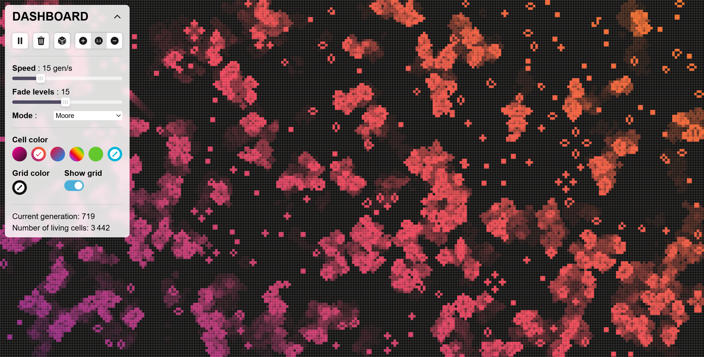

# Game of Life

A 3D puzzle game where every parking lot is procedurally generated with the goal of freeing all the trapped vehicles across an endless series of unique levels

## Play the game

You can play it directly in your browser: [Infinity-Parking](https://capyblaze.github.io/Infinity-Parking)

## What is the project?

It is a 3D low poly parking puzzle game for the web. The goal is to move cars around to unblock the parking lot. I built this using React and Three.js with React Three Fiber. For the rest of the stack I used TypeScript TailwindCSS Zustand for state management and Vite

## Why did you build it?

Most puzzle games have a set number of levels and when you finish them the game is just over. I wanted to fix that problem by creating a game where players literally never run out of puzzles to solve

## Inspiration

The whole idea started because I wanted to make a game with infinite levels. Initially I found some 2D pixel art car assets online and thought about making a simple 2D parking game. Later on I found a really cool 3D low poly asset pack that included cars roads and buildings so I decided to upgrade the project to full 3D

## Theme

Theme selected: **Endless**

This project fits the endless theme perfectly because the game has no ending. Every single parking lot is procedurally generated by the code, meaning that all levels are completely different and the difficulty increases progressively as you advance. There is no final boss or final screen. You can just keep solving puzzles and freeing trapped cars forever.

## How do I test it?

The fastest way to test it is to use the live link above
If you want to run it locally on your machine just follow these steps

1. Clone this repository
   `git clone https://github.com/CapyBlaze/Game-Of-Live.git`

2. Go into the project folder
   `cd Game-Of-Live`

3. Install the dependencies
   `npm install`

4. Start the development server
   `npm run dev`

## Screenshots

| Menu                                    | Gameplay                                |
| --------------------------------------- | --------------------------------------- |
|  |  |
|  |  |

## Demo Video

[Link to YouTube video demo](https://youtu.be/pW2E-FlHgxw)
